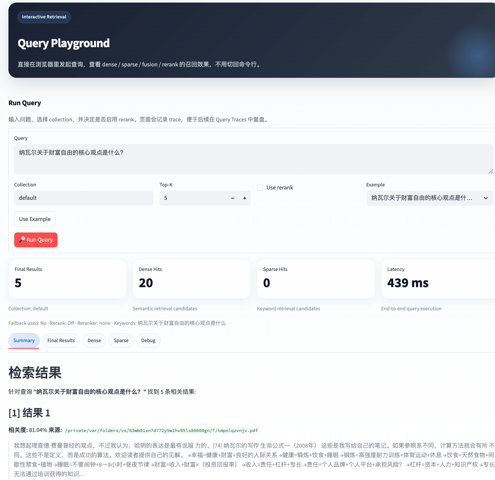
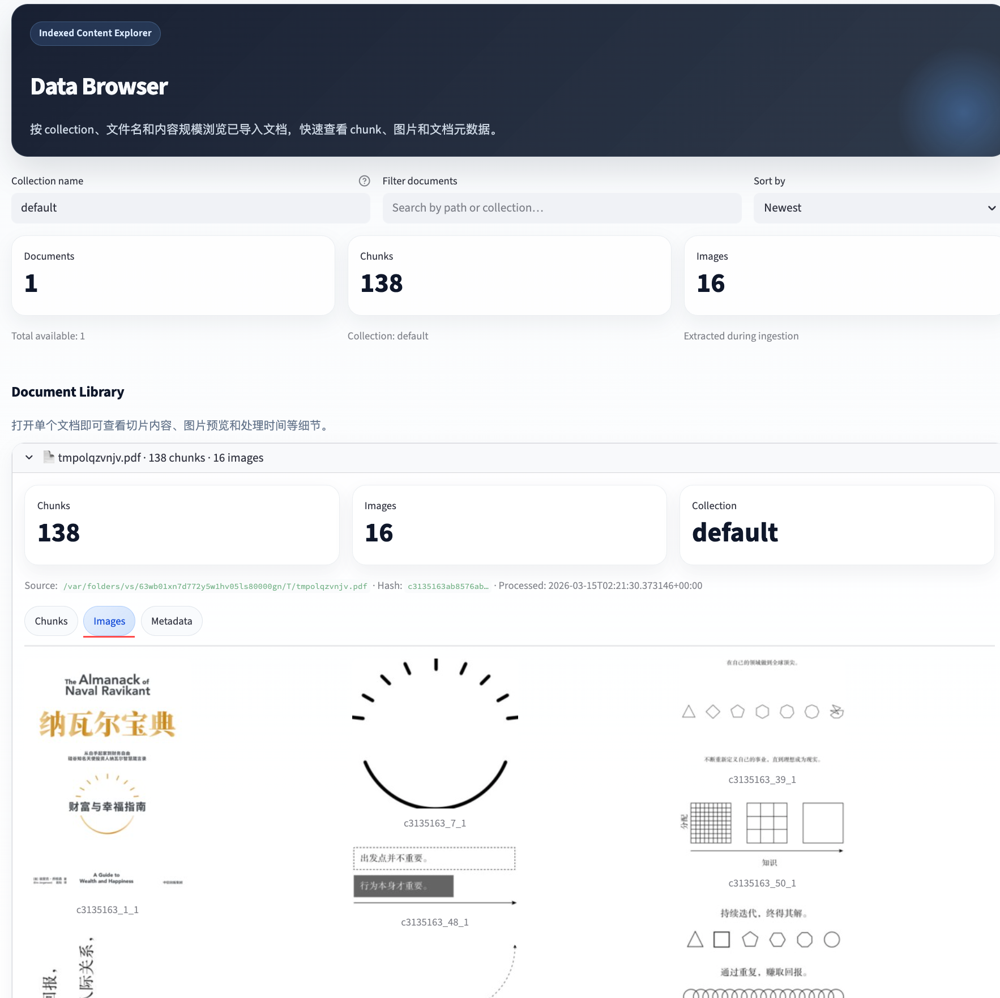

# Hybrid RAG MCP Server

  <a href="./README.zh-CN.md">简体中文</a> |
  <a href="./README.en.md">English</a>

> A modular, observable RAG framework with MCP integration.  
> 一个可插拔、可观测、支持 MCP 集成的模块化 RAG 框架。

## Language

- [简体中文文档](./README.zh-CN.md)
- [English Documentation](./README.en.md)

## Preview

### Query Playground

### Data Browser

## Quick Links

- [中文快速开始](./README.zh-CN.md#快速开始)
- [English Quick Start](./README.en.md#quick-start)
- [中文配置说明](./README.zh-CN.md#配置说明)
- [English Configuration](./README.en.md#configuration)

## Notes

- This repository keeps the homepage README minimal and uses separate Chinese and English documents for readability.
- 本仓库首页 README 保持精简，中英文内容分别放在独立文档中，方便在 GitHub 首页直接点击切换。
